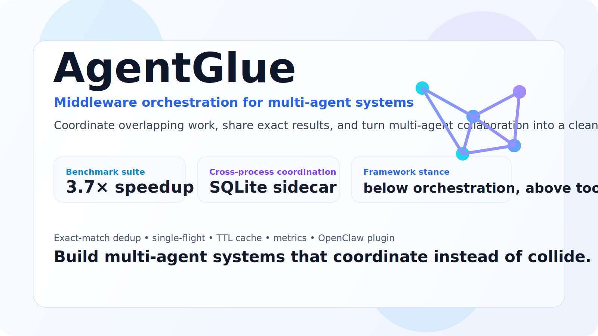

<p align="center">
  
</p>

<h1 align="center">AgentGlue</h1>
<p align="center"><strong>Middleware orchestration for multi-agent systems.</strong></p>

<p align="center">
  <a href="https://github.com/brickee/AgentGlue/releases"></a>
  <a href="https://www.npmjs.com/package/openclaw-agentglue"></a>
  <a href="LICENSE"></a>
</p>

<p align="center">
  <a href="#-hilights">Hilights</a> •
  <a href="#-key-features">Key features</a> •
  <a href="#-how-it-works">How it works</a> •
  <a href="#-install">Install</a> •
  <a href="#-quick-example">Quick example</a>
</p>

AgentGlue is a **middleware layer** that sits between your orchestrator and your tools, helping multi-agent systems coordinate overlapping work instead of repeating the same reads, searches, API calls, and state lookups over and over again.

## 📈 Hilights

Measured on the current **100-test benchmark suite** and **overlap-heavy multi-agent workloads**:

- **3.7× overall speedup** across benchmarked scenarios
- **73% total time saved** *(`866.4ms → 234.9ms`)*
- **76% cache hit rate** across repeated shared work
- **6.8× speedup** on *overlapping search-heavy scenarios*
- **5.0× speedup** in the *10-agent heavy-overlap case*
- **~0.6ms median cache-check latency**

> ***More agents + more overlap = bigger wins.***

## ✨ Key features

- **Exact-match dedup** on tool name + args/kwargs hash
- **Single-flight / in-flight coalescing** for concurrent identical calls
- **TTL result cache** for repeated sequential calls
- **SQLite-backed cross-process cache** for shared coordination across processes
- **Metrics and event recording** for runtime inspection
- **Keep shared work coordinated** across agents, tools, and processes
- **Stay framework-agnostic** across *OpenClaw, AutoGen, CrewAI, LangGraph,* and custom systems

## 🧭 How it works

```text
┏━━━━━━━━━━━━━━━━━━━━━━━━━━━━━━━━━━━━━━━━━━━━━━━━━━━┓
┃  🤖 Agent A    🤖 Agent B    🎯 Orchestrator       ┃  ← Intelligence Layer
┃                                                   ┃    Autonomous reasoning
┃  "Decide what to do"                              ┃    & task decomposition
┣━━━━━━━━━━━━━━━━━━━━━━━━━━━━━━━━━━━━━━━━━━━━━━━━━━━┫
┃                 ⚙️  AgentGlue                     ┃  ← Coordination Layer
┃         (Coordination Middleware)                 ┃    The "glue" that binds
┃                                                   ┃    agents to resources
┃  ┌──────────┬──────────┬──────────┬──────────┐    ┃
┃  │ Registry │  Router  │ State    │   Auth   │    ┃    · Registry:  discover tools
┃  │          │          │ Manager  │          │    ┃    · Router:    dispatch calls
┃  └──────────┴──────────┴──────────┴──────────┘    ┃    · StateMgr:  share context
┃                                                   ┃    · Auth:      access control
┃  "Know how to connect"                            ┃
┣━━━━━━━━━━━━━━━━━━━━━━━━━━━━━━━━━━━━━━━━━━━━━━━━━━━┫
┃  🔧 Tools    📡 APIs    📁 Files    💾 State       ┃  ← Resource Layer
┃                                                   ┃    External capabilities
┃  "Do the actual work"                             ┃    & persistent storage
┗━━━━━━━━━━━━━━━━━━━━━━━━━━━━━━━━━━━━━━━━━━━━━━━━━━━┛
```

**AgentGlue sits in the middle**: agents keep their existing orchestration logic, tools keep their existing interfaces, and AgentGlue coordinates repeated work across both.

## 🛠 Install

### 1) Install the OpenClaw plugin

```bash
openclaw plugins install openclaw-agentglue
```

After install, restart the gateway:

```bash
systemctl --user restart openclaw-gateway
```

If you want to remove the `plugins.allow` security warning, add this to `~/.openclaw/openclaw.json`:

```json
{
  "plugins": {
    "allow": ["openclaw-agentglue"]
  }
}
```

Plugin docs: [`openclaw-agentglue/README.md`](./openclaw-agentglue/README.md)

### 2) Clone the repo

```bash
git clone https://github.com/brickee/AgentGlue.git
cd AgentGlue
```

### 3) Install the Python package

```bash
python3 -m venv .venv
source .venv/bin/activate
pip install -U pip
pip install -e .
```

## ⚡ Quick example

```python
from agentglue import AgentGlue

glue = AgentGlue(shared_memory=False, rate_limiter=False, task_lock=False)

@glue.tool(ttl=60)
def search_code(query: str) -> str:
    return f"results for {query}"

print(search_code("sqlite sidecar", agent_id="agent-a"))
print(search_code("sqlite sidecar", agent_id="agent-b"))
print(glue.report())
```

## 🔌 Links

- **GitHub releases:** <https://github.com/brickee/AgentGlue/releases>
- **OpenClaw plugin:** <https://www.npmjs.com/package/openclaw-agentglue>
- **Plugin docs:** [`openclaw-agentglue/README.md`](./openclaw-agentglue/README.md)

## ⚖️ Disclaimer

*This project is a personal open-source project developed in my personal capacity. It is not affiliated with, endorsed by, or representing any employer or organization I am associated with. All work on this project is performed on personal time and with personal resources.*

## 📄 License

MIT
